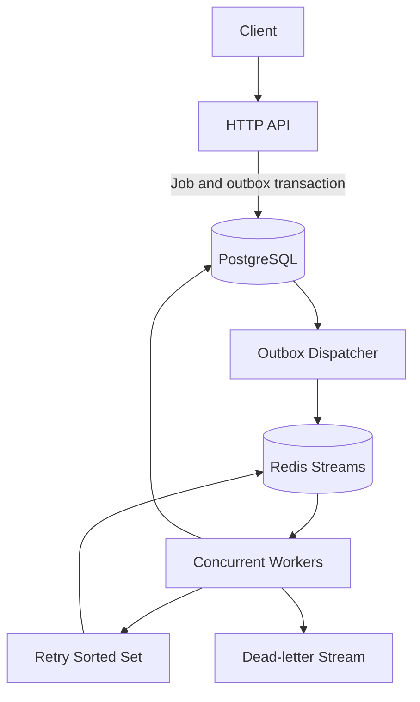

# TaskForge
[](https://github.com/sindhoora-17/taskforge/actions/workflows/ci.yml)

TaskForge is a distributed background job execution platform written in Go. It accepts jobs through an HTTP API, stores job state in PostgreSQL, publishes work through Redis Streams, and executes jobs across concurrent, horizontally scalable worker processes.

The platform implements retries, execution timeouts, crash recovery, dead-letter handling, transactional outbox delivery, atomic job claiming, and operational metrics.

> **Project status:** TaskForge v1 is operational end to end and ready for local deployment through Docker Compose.

## Features

### Job Management

- HTTP API for submitting and retrieving jobs
- UUID-based job identifiers
- PostgreSQL-backed job state
- Configurable maximum attempts
- Per-job execution timeouts
- Job lifecycle tracking: `queued`, `running`, `retrying`, `completed`, and `failed`
- Input validation and structured JSON errors

### Distributed Execution

- Redis Streams job queue
- Redis consumer-group processing
- Concurrent Go worker pools
- Horizontal worker scaling with Docker Compose
- Distribution across multiple worker processes
- Atomic PostgreSQL job claiming using compare-and-set updates
- Duplicate-execution protection for at-least-once queue delivery

### Reliability

- Automatic retries with exponential backoff
- Redis sorted-set scheduling for delayed retries
- Persistent retry errors and next-attempt timestamps
- Worker heartbeats for long-running jobs
- Automatic recovery of stale messages after worker crashes
- Dead-letter stream for jobs that exhaust their attempts
- Dead-letter metadata including attempts, errors, and original message IDs
- Exponential worker backoff during Redis outages
- Automatic recovery when Redis becomes available again

### Transactional Outbox

- Atomic creation of jobs and outbox events in PostgreSQL
- Background outbox dispatcher
- PostgreSQL row locking with `FOR UPDATE SKIP LOCKED`
- Persistent exponential backoff for publishing failures
- Automatic delivery after Redis outage recovery
- API job acceptance without requiring Redis to be available

### Operations and Testing

- Health-check endpoint
- Database-backed operational metrics endpoint
- Versioned SQL migrations
- Unit tests for API handlers, executors, workers, retries, heartbeats, recovery, timeouts, and duplicate claiming
- End-to-end k6 load test
- Multi-stage Docker builds
- Docker Compose development environment

## Architecture



The API does not publish directly to Redis. It commits the job and an outbox event in one PostgreSQL transaction. The dispatcher later publishes that event to Redis and records successful delivery.

Workers consume messages through a Redis consumer group. Before execution, each worker atomically claims the corresponding PostgreSQL job. This prevents multiple workers from executing duplicate messages concurrently.

## Reliability Model

TaskForge uses **at-least-once message delivery** with duplicate-execution protection.

- PostgreSQL is the source of truth for job state.
- Redis Streams distributes work across consumers.
- Atomic compare-and-set updates allow only one worker to claim a job state.
- Heartbeats keep active long-running messages from being incorrectly reclaimed.
- Stale pending messages are claimed when a worker crashes.
- Failed jobs retry with exponential backoff.
- Exhausted jobs are moved to a dead-letter stream.
- The transactional outbox prevents jobs from being lost when Redis is unavailable.

Executors must respect Go context cancellation for execution timeouts to stop work cooperatively.

## API

### Health Check

```http
GET /health
```

Example response:

```json
{
  "service": "taskforge-api",
  "status": "healthy"
}
```

### Submit a Job

```http
POST /jobs
Content-Type: application/json
```

Example request:

```json
{
  "type": "generate_report",
  "payload": {
    "report_name": "monthly-sales"
  },
  "max_attempts": 3,
  "timeout_seconds": 30
}
```

`max_attempts` defaults to `3` and must be between `1` and `10`.

`timeout_seconds` defaults to `30` and must be between `1` and `3600`.

Example response:

```json
{
  "id": "f6cb76fe-7fcf-48fd-b2fe-7661a84503e0",
  "type": "generate_report",
  "payload": {
    "report_name": "monthly-sales"
  },
  "status": "queued",
  "attempts": 0,
  "max_attempts": 3,
  "timeout_seconds": 30,
  "created_at": "2026-09-03T03:54:39Z",
  "updated_at": "2026-09-03T03:54:39Z"
}
```

### Retrieve a Job

```http
GET /jobs/{id}
```

Example:

```bash
curl http://localhost:8080/jobs/JOB_ID
```

### Operational Metrics

```http
GET /metrics
```

Example response:

```json
{
  "total": 1281,
  "queued": 1,
  "running": 0,
  "retrying": 0,
  "completed": 1277,
  "failed": 3,
  "pending_outbox": 0
}
```

Metrics are calculated from PostgreSQL and report the current persisted state of the platform.

## Demonstration Job Types

### `generate_report`

Generates a JSON report in the worker's output directory.

```json
{
  "type": "generate_report",
  "payload": {
    "report_name": "monthly-sales"
  }
}
```

### `flaky_task`

Simulates transient failures to demonstrate retry behavior.

```json
{
  "type": "flaky_task",
  "payload": {
    "failures_before_success": 2
  },
  "max_attempts": 3
}
```

### `slow_task`

Simulates long-running work and supports context cancellation.

```json
{
  "type": "slow_task",
  "payload": {
    "duration_ms": 10000
  },
  "max_attempts": 2,
  "timeout_seconds": 1
}
```

This example times out after one second, retries once, and then moves to the dead-letter stream.

## Run Locally

### Requirements

- Docker Desktop
- Docker Compose
- Go 1.27 or later, if running services outside Docker

### 1. Configure the environment

```bash
cp .env.example .env
```

### 2. Start PostgreSQL and Redis

```bash
docker compose up -d postgres redis
```

### 3. Apply migrations

For a new database, apply all migrations in order:

```bash
for migration in migrations/*.up.sql; do
  docker compose exec -T postgres psql \
    -v ON_ERROR_STOP=1 \
    -U taskforge \
    -d taskforge \
    < "$migration"
done
```

For an existing database, apply only migrations that have not already been applied.

### 4. Start the API and workers

```bash
docker compose up --build -d --scale worker=2
```

### 5. Verify the deployment

```bash
docker compose ps
curl http://localhost:8080/health
curl http://localhost:8080/metrics
```

### 6. View worker activity

```bash
docker compose logs -f worker
```

### 7. Stop the deployment

```bash
docker compose down
```

Named PostgreSQL and Redis volumes are preserved by this command.

## Scale Workers

Start four worker processes:

```bash
docker compose up -d --scale worker=4
```

Each worker process runs a configurable concurrent consumer pool.

## Inspect Redis State

Check pending consumer-group messages:

```bash
docker compose exec redis redis-cli \
  XPENDING taskforge:jobs taskforge-workers
```

Inspect scheduled retries:

```bash
docker compose exec redis redis-cli \
  ZRANGE taskforge:retries 0 -1 WITHSCORES
```

Inspect the newest dead-lettered job:

```bash
docker compose exec redis redis-cli \
  XREVRANGE taskforge:dead-letter + - COUNT 1
```

## Run Tests

Run the complete test suite:

```bash
go test ./...
```

Display individual test results:

```bash
go test -v ./...
```

Run only worker tests:

```bash
go test -v ./internal/worker
```

## Load Testing

The k6 test submits jobs and polls their status until completion, measuring the full API-to-worker pipeline.

Run it without installing k6 locally:

```bash
docker run --rm -i \
  -e BASE_URL=http://host.docker.internal:8080 \
  grafana/k6 run - \
  < loadtest/jobs.js
```

### Local Benchmark

Configuration:

- 2 worker processes
- 4 concurrent consumers per worker
- 10 k6 virtual users
- 30-second test
- Local Docker Desktop environment

Results:

| Metric | Result |
|---|---:|
| Completed jobs | 1,246 |
| Completion throughput | 41.26 jobs/second |
| Average end-to-end completion | 241.97 ms |
| Median end-to-end completion | 219 ms |
| p90 end-to-end completion | 329 ms |
| p95 end-to-end completion | 336 ms |
| Maximum end-to-end completion | 532 ms |
| HTTP request failure rate | 0% |
| Successful checks | 100% |
| Pending Redis messages after test | 0 |

Results depend on the host machine and Docker resource allocation.

## Project Structure

```text
taskforge/
├── cmd/
│   ├── api/
│   └── worker/
├── internal/
│   ├── executor/
│   ├── job/
│   ├── outbox/
│   ├── queue/
│   ├── repository/
│   └── worker/
├── loadtest/
├── migrations/
├── Dockerfile
├── docker-compose.yml
└── README.md
```

## Technology Stack

- Go
- PostgreSQL
- Redis Streams
- pgx
- Docker
- Docker Compose
- k6

## Future Improvements

- Scheduled jobs
- Priority queues
- Job cancellation
- Prometheus metrics
- OpenTelemetry distributed tracing
- PostgreSQL and Redis integration-test containers
- Authentication and per-client quotas

[](https://github.com/sindhoora-17/taskforge/actions/workflows/ci.yml)